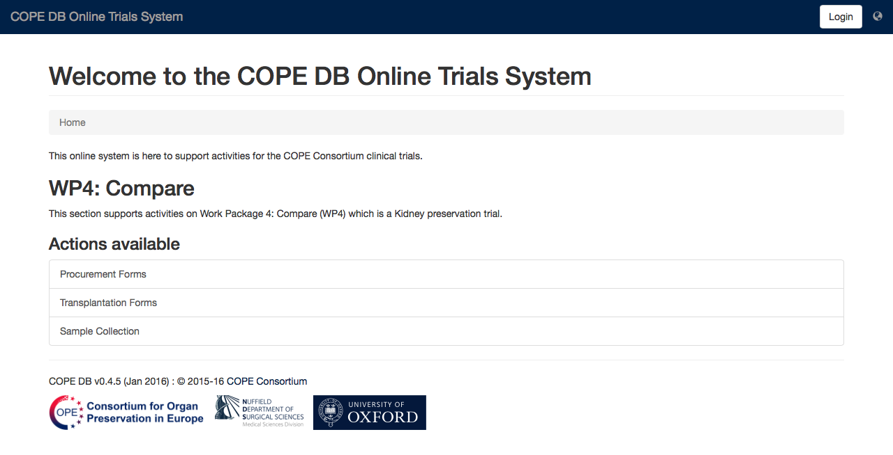
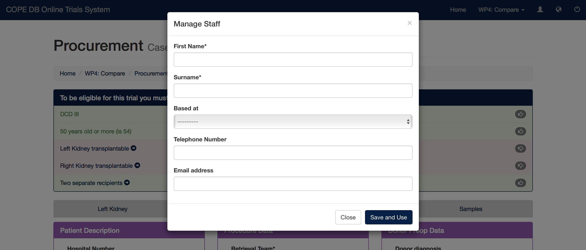
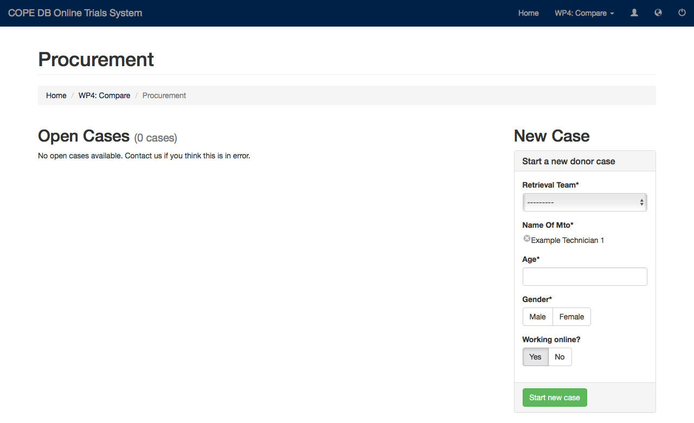

# COPE DB User Manual

Welcome to the COPE DB Online Trials System. This guide provides an overview of what to expect as a user.

* Written by: *Carl Marshall*
* For DB version: *0.4.5*
* Last updated: *18th Jan 2016*

## Overview
By visiting the system at [https://cope.nds.ox.ac.uk/]() you should see a page similar to the one below:

A few key areas are:

* **The Navbar** - in blue, at the top of the screen. 
* **Page title** - largest text just under the Navbar]
* **Page trail** - Otherwise called Breadcrumbs, this should help you locate where in the system you are presently viewing
* **Footer** - At the bottom of the page, under a pale grey line are links to the supporting organisations and information about the current system version
* **Page Content** - is everything between the Footer and the Page Trail

The above image is of the Home page, when logged out. To access most sections of the system you will need a username and password (supplied by the COPE Admin team). 

> **Please ensure you keep your username and password details secure, and do not share them with anyone else**. All system actions are recorded and logged against the relevant user account for auditing purposes and you will be held to account for any actions taken with your user account.

### Logins and Passwords

Clicking on the Login button on the NavBar or any link that goes to a secure page will take you to the *Login page*, where you will be asked for your username and password. If you have forgotten your password, you an click on the `Lost Password?` link under the username text input, and you will be taken to a *Password Reset page*. Enter your registered email address (if you're not sure which one that is, please contact the COPE Admin team) to have a password reset link emailed to you. Once you have that email, clicking on the link will take you back to the website and prompt you to enter a new password twice.

Once you are logged into the system, the Navbar will update to something similar to the image below:

In the upper right corner of the page, on the Navbar you should now see some new links and menus. Working from the right hand edge to the left, we have:

* **Logout** - the "power on/off" icon is to securely log you out of the system. You should use this anytime you leave your computer or the website.
* **Locale** - the "globe" icon is to allow you to select your current location and will update the system to use terminology appropriate to your country
* **User** - the "person outline" icon is the User menu and shows some basic information about your account, and a link to Change Password
* **WP4 Menu** - The text "WP4: Compare" has a small menu linking to the various sections of the website, we'll cover more of this in a moment.
* **Home** - will take you back to the system home page from earlier (though still logged in).

### Form Widgets / Inputs

There are a few conventions to be aware of that are used to help you collect accurate data easily as possible.

#### Questions with followups
Some questions (typically ones with "other" options, or Yes/No answers) will have additional questions related to the answer given for the first one. You should be aware of these causing the form to add questions (sliding into view) in real-time, and directly below the question you've just answered. 

#### Date & Time questions
These can be recognised by the grey "calendar" icon to the right of the text entry, and placeholder text similar to `DD-MM-YYYY` (for dates) or `DD-MM-YYYY HH:MM` (for dates and times). You can type dates into these fields directly, or you can click on the icon to the right to get a calendar popup widget displayed, such as:

In the above image we can see 5 examples.

* **A:** Is the default display, allowing you to select the date from the month shown at the top of the small window. Clicking on a number will change the date text to reflect that choice.
* **B:** At the top of the window in A, we see the Month and Year (January 2016). Clicking on either of the arrows to each side of that will move forward or backwards in time in monthly increments. Clicking on the text itself will take you to image B, which shows you the month in the displayed year. Clicking on a month will take you to the days in that particular month to select from.
* **C:** Clicking again on the date at the top of B will take you to a list of years within that decade. Clicking on the text at the top again will take you to a decade selection list shown in image C. Clicking on the options will drill down till you get back to the days again.
* **D:** At the bottom of the date selectors, when a time is also required, there will be a clock icon displayed. Clicking on that will result in the time wheels being displayed in example D. Using the arrows will advance or decrease the hours and minutes (left and right numbers, respectively).
* **E:** Clicking on one of the time numbers in D will result in something like example E (for minutes) allowing you to get closer to your intended time with fewer clicks. Finally, clicking on the calendar icon at the top of the time selectors will return you to the date picking options.

You will need to click off of the calendar area to hide the display and leave just the selected date behind.

#### Not Known

There are questions that we know will result in some headscratching or examples of where local processes do not collect something we are asking for. In these cases, we want you to mark these special fields with Not Known. Some have the answer as Unknown in the list, and you can select that when appropriate. Others will need you to identify them by the Circle with diagonal bar across it, to the left of the input fields, and to click on that icon. It will disable the data entry for that question and mark it as Not Known.

To change your mind, click it again, and the field will be re-enabled for use.

#### People and Locations

There are a range of questions where we want to know about either people, or locations (i.e. hospitals). In these cases we may not know about them before you start data entry, so we will want you to add some extra information to help complete the record.

Apart from the question label as the first clue, you can identify these fields by the greyed out appearance (so that you can't type directly into them), and the magnifying glass icon to the right hand side. Clicking on the magnifying glass will bring up another window with the currently available option in.

Using the example of "Name of the SN-OD", this is the list of people known to the system so far. If the correct answer is one of these people, clicking on them will close the window and put the answer in the form. If the answer is someone else, then clicking on Add Person will let us create a new staff member.

To complete this form (shown above) we need to know their first name and last names as a minimum. However, since this is to aide contacting people in case of followups, we really want to know more, like where they are based (pick an existing location - if one doesn't exist, you'll have to create it via another question first), their telephone number, and an email address.

Whilst it is possible to edit the contact information of existing people, please do so with care, as this information may be critical for other cases also.

When dealing with either locations or people, the list may grow to be larger than the available screenspace. In which case it will fill from top to bottom as shown above (with Manage Hospitals), and you can scroll the screen to find the correct entry, or to the bottom to find the Add Hospital Option.

Adding a new location is a little easier than a person, and only requires two bits of information at this stage: Name of the location, and the country it is based in.

As with both forms, clicking Save and Use will save the data (making it available for other cases) and use the result to populate the form field.

#### Searchable / Typeahead fields

There are a limited number of fields where you can find an answer by typing part of the answer into a field, and then selecting from the list of matching results that appears. You do need to click on a valid result for this field to be completed, simply typing the answer is not sufficient. If you can't find the answer you're looking for, please contact COPE Admin. If you want to change the answer, you will see a small grey circle with a cross in next to the answer - click that and it will return to being an empty field to type and search again in.

#### Saving data

**Save early, and often.** The forms are all setup so that you can enter incomplete data and still save the results, allowing you to come back to your data entry again and again. However, if you make a mistake during entry that the system can detect, you will need to correct that error before it will save any of your recent changes.

Upon saving you should see a message such as:

If you have made a mistake, then you will see errors highlighted in a variety of ways (dependant upon the type of mistake).

There will be the general error message at the top of the page content area (in this example counting one error).

When the answer relates to a specific field, it may be highlighted directly with advice given below it (such as in the Date of Birth example above).

And it is possible to have multiple mistakes highlighted on save, in which case you may see an error count in the tabs affected, as well as help messages above the forms.

Try and correct all the errors, and then save again. It is possible to have recurring (though perhaps different) errors, so don't stop correcting until you see the green successful save message.

## WP4: Compare

The system is currently focussed on the WP4 trial. There are two key sections: Procurement and Transplantation

### Procurement

When you first start and click on Procurement (*Procurement Files* on the *Home* page, or `WP4:Compare -> Procurement` in the Navbar) you are likely to see an empty screen similar to above. On the left would be a list of cases you are currently working on (Open Cases). On the right is a small form to start off a New Case.

#### New Cases
To start a new case (i.e. to collect Donor and Organ details during retrieval) you need the following information as a minimum:

* **Name of the Retrieval Team**
* **Name of the MTO/Transplant Technician** - This should default to your name if you are registered as a Perfusion Technician on the system
* **Age of the Donor** - remember 50 years old or more
* **Gender of the Donor**

Additionally, to allow for all eventualities, we need to account for when things go wrong with the data recording. We anticipate the following scenarios:

1. Data is entered as it is collected, and saved frequently. This presumes you have internet connectivity on whichever device you are using for data collection.
2. If you have connectivity issues, then the expectation is that you will take notes on the procedure (perhaps using the backup Paper form as a template) for you to enter into the system when connectivity returns. However, if you need to Randomise and can't connect to the system, you need to contact your nearest co-ordinator.

The co-ordinator will do one of two things: 

* Assuming they can access the system, they can enter the basic information needed to randomise based on feedback from you. The case should then appear on your list of Open Cases when you next get online access and you can resume data entry.
* If the system is offline (such as for maintenance), then they will have access to a small list of values to allow them to randomise the case offline. Upon consulting this list, they will give you an Offline Case ID (three digit number), which you (or they, presuming they have your notes) can use upon regaining access to the system to link up with the correct randomisation record.

**In short:** Work ONline throughout. If no connection, contact co-ordinator. Use paper notes to record details that you can't get into the system immediately, but resume online once you can.

Once you have entered the basic information, you can click `Start new case` to move onto the main data entry form

#### Editing a Case

In this example, we have started a case as *Example Technician 1*, with the retrieval team from *Royal London Hospital, UK*. The donor is *Female*, and *54 years old*. We have confirmed that we are working *Online* presently.

Four key areas to point out in this initial screen view of the case:

* **Page Title** - states Procurement (as previous page), but also shows the Case identifier. Until a case is randomised, it has a system assigned ID for reference purposes. In this case, the indentifier is *DO026*
* **Eligibility Criteria** - Under the Page trail is the list of eligibility criteria for this trial. We trust you to only start recording cases that are *DCDIII*, but we will confirm things like age (50+), whether the kidneys have been deemed transplantable, and if there are two separate recipients. More on this below.
* **Action Bar** - attached to the bottom of the screen is a light grey bar with (currently) on button on it at the right hand side. Be default that button will say `Save`, however, it will change depending on the state of the form (again, see details below).
* **Data collection areas** - In the main page content area under the eligibility criteria, there are a range of tabs and data entry fields. This is where the majority of the information and interaction will happen.

Of the data collection areas, there are four tabs containing sets of questions:

* **Left Kidney** - all about one of the two organs we're transplanting
* **Donor** - core information about the donor of the organ(s)
* **Right Kidney** - the other organ
* **Samples** - information specific to the samples being taken. Varies depending on your region (for example, UK Donor's don't record any sample information)

**You can enter data in any order you wish, and you can save the form at any time to ensure data is not lost.** Answers are partially validated on each save, and you need to clear all errors to complete a save, otherwise changes will be lost. When data entry for the case is ready to complete and be signed off, there will be extra checks made on the data to help identify any recurring issues with data quality.

#### Donor data

On the donor tab we have 6 subsections, and an extra question related to data entry completion. These areas are:

* Patient Description - generic information about the donor as a patient
* Donor Details - extra data related to donors specifically
* Procedure Data - records of the technician's actions and logistics
* Donor Pre-op Data - much like it says, information from prior to extraction
* Donor Procedure - data from during the extraction
* Lab Results - local records of creatinine

The system will prompt you on saving to complete any missing related information as you work through the form, so be used to saving frequently and looking for the success or error message that will appear on the top of the form:

